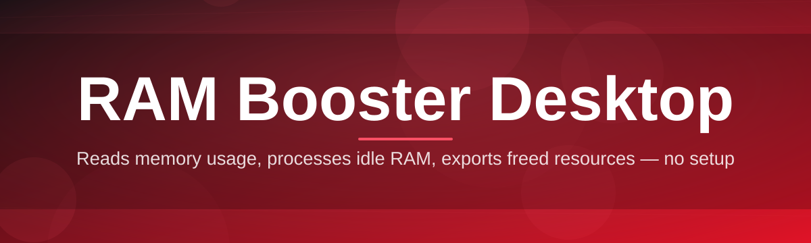
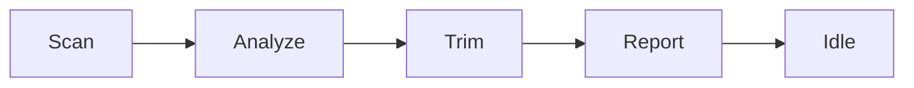

# ram-desktop-booster 🚀🧠

  

*Give your Windows box its memory back — no bloat, no nonsense, just headroom.*

  

## 🔍 Overview

Windows has a bad habit of hoarding memory like a squirrel before winter — background services, leftover caches from apps you closed an hour ago, and standby memory that never gets released back to where it's actually needed. **ram-desktop-booster** exists because watching your RAM usage graph climb to 90% while you're just trying to run a browser and an editor is genuinely annoying, and rebooting shouldn't be your only fix.

This is a lightweight RAM booster and memory optimizer built for people who actually use their machines hard — streamers juggling OBS and a dozen Chrome tabs, developers with three IDEs and a Docker daemon running, or gamers who want every last megabyte free before a match. It watches your system's memory behavior, trims the fat where it's safe to do so, and gives you a live, honest picture of what's actually happening under the hood — not a fake "cleaned 4GB!" popup that does nothing.

Who's this for? Anyone tired of memory leaks slowly choking their session, anyone who wants a desktop RAM cleaner that doesn't ask for a subscription, and anyone who just wants their PC to feel as fast on day 200 as it did on day 1. If that's you, keep reading.

---

## ⚡ What It Actually Does

> [!TIP]
> Skip to **How It Works** below for the technical flow if you're the type who reads architecture diagrams before README prose.

- **Standby memory reclamation** — Windows loves to cache stuff "just in case." This tool politely asks it to let go of memory that isn't earning its keep, freeing it for the apps you're actually running right now.

- **Live memory telemetry** — a real-time graph, not a static number. Watch used, cached, and free RAM shift as you open and close apps, so you actually understand your own system instead of guessing.

- **One-click optimization pass** — hit a single button and the app runs a full sweep: trims working sets, flushes what's safe to flush, and reports exactly what changed, in plain numbers.

- **Background auto-boost** — set a threshold (say, 85% usage) and the app quietly steps in when you cross it, without you having to babysit a taskbar icon all day.

- **Per-process memory insight** — sortable list of what's eating your RAM right now, so you can spot the runaway Electron app or the browser tab that forgot to close itself.

- **Startup impact scoring** — see which apps are quietly loading themselves into memory at boot and decide if they've earned that privilege.

- **Zero telemetry, zero accounts** — this isn't phoning home. It's a standalone Windows utility, not a SaaS product wearing a desktop costume.

- **Portable-friendly footprint** — small install size, minimal CPU draw while idle, and it doesn't try to become the center of your system tray life.

> [!NOTE]
> None of this replaces buying more RAM if you're genuinely maxed out — it just makes sure the RAM you *have* is being used honestly.

---

## 🏁 Getting Started

1. Head to the [project landing page](https://Ghosttiamend.github.io/ram-desktop-booster/) using the download button above.

2. Grab the latest build — it's a single standalone executable, nothing to configure ahead of time.

3. Run it. Windows SmartScreen might flag an unsigned app on first launch — click *More info → Run anyway*.

4. The dashboard opens showing your current memory state. From there, either run a manual boost or flip on auto-boost mode and forget about it.

> [!IMPORTANT]
> Run as Administrator for full standby-memory reclamation. Without elevated permissions, the app still works but with reduced access to deeper system memory operations.

---

## 🖥️ System Requirements

| Requirement | Details |
|---|---|
| OS | Windows 10 (64-bit) or Windows 11 |
| Dependencies | None — fully standalone executable |
| Disk space | Under 50 MB |
| RAM | Works fine on systems with as little as 4GB, shines brightest on 8GB+ setups |
| Internet | Not required after download |

---

## 🛠️ How It Works

The core loop is intentionally simple — complexity is the enemy of a tool meant to make your PC *less* complicated.

1. **Scan** — the app queries the Windows memory manager for current usage across physical, cached, and standby memory pools.

2. **Analyze** — it identifies which cached and standby regions are safe to release without disrupting active applications.

3. **Trim** — working sets of idle or oversized processes get trimmed, and reclaimable standby memory is released back to the free pool.

4. **Report** — you get a clear before/after readout, not a vague "optimized!" message.

5. **Repeat** — if auto-boost is on, this cycle quietly runs again whenever your threshold is crossed.

---

## 🧩 Troubleshooting

<b>The boost freed memory but usage climbed right back up — is it broken?</b>

Not broken — that's normal Windows behavior. Apps you have open will re-claim memory as they need it. The point of a RAM booster isn't to keep usage artificially low forever, it's to free up headroom exactly when you need it, like before launching a game.

<b>Why does the app request admin rights?</b>

Standby memory reclamation and deep working-set trimming are privileged operations in Windows. Without elevation, the app can still do lighter cleanup, but it won't reach the same depth.

<b>Antivirus flagged it — is this safe?</b>

Memory-management tools that touch process working sets sometimes trigger heuristic false positives because the *techniques* resemble what some malware uses — the *intent* here is entirely different. The project is open-source, so you can review exactly what it does.

<b>Auto-boost isn't triggering at my set threshold.</b>

Check that the background service toggle is actually enabled in Settings — it's a separate switch from the manual boost button, and it's easy to miss on first setup.

<b>Does this replace a page file or virtual memory tuning?</b>

No — this manages physical RAM usage patterns. Page file size is a separate Windows setting and this tool doesn't touch it.

---

## 🎨 UI / UX Details

The interface leans dark by default because that's what most desktops running this kind of tool actually look like — but a light theme is one click away in Settings.

- `Ctrl + B` — run a manual boost instantly

- `Ctrl + ,` — open Settings

- `Ctrl + Shift + M` — toggle the live memory graph overlay

- `Esc` — minimize to tray

Settings persist locally in a small config file — no cloud sync, no account needed. Themes include Dark, Light, and an auto mode that follows your Windows theme setting.

 

---

## 🤝 Contributing & Community

> [!NOTE]
> This started as a solo project and ships fast — issues and PRs get triaged quickly, not left to rot for six months.

Bug reports, feature requests, and pull requests are all welcome. If you're fixing something, open an issue first so we're not duplicating effort. Translations, UI polish, and edge-case Windows build compatibility are especially appreciated contributions.

- Found a bug? Open an issue with your Windows build number and a screenshot of the memory graph if relevant.

- Got an idea? Describe the *problem* it solves, not just the feature — helps prioritize.

- Want to contribute code? Keep changes focused and readable — this isn't a place for clever one-liners nobody can maintain later.

---

## 📜 License

Released under the [MIT License](LICENSE), 2026. Use it, fork it, ship it in your own tools — just keep the license notice intact.

---

## ⚠️ Disclaimer

> [!WARNING]
> This tool optimizes software-level memory allocation and caching behavior. It cannot add physical RAM to your machine, and it is not a substitute for a hardware upgrade if your system is genuinely under-provisioned. Use at your own discretion — always keep backups of important work regardless of what optimization software you're running.

---

